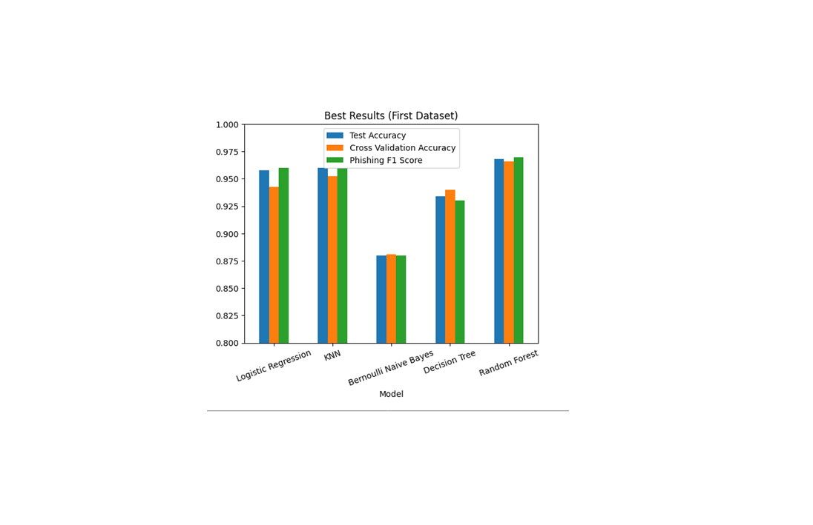
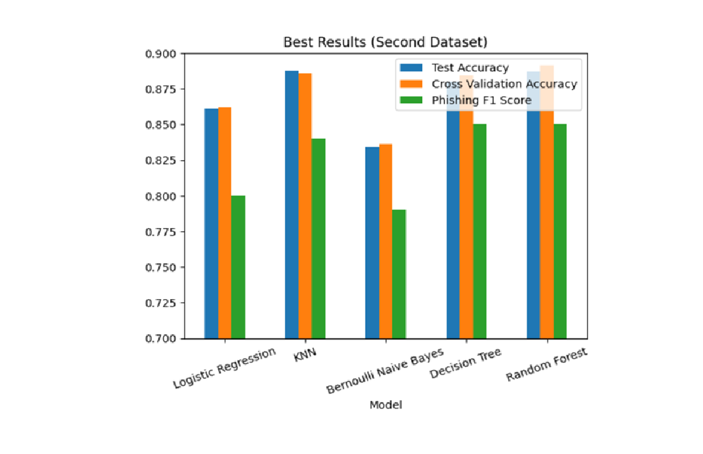
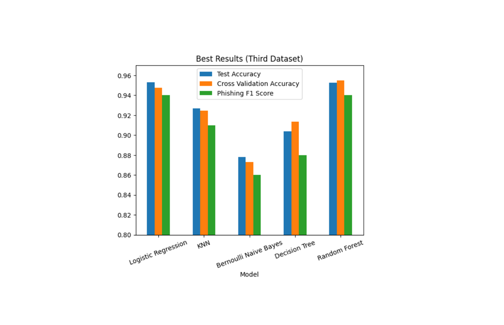

# Phishing Detection Capstone Project
## Overview
This project used supervised machine learning techniques to distinguish between phishing and non-phishing urls and emails. This analysis focused on appropriate evaluation metrics and tradeoffs relevant to real-world phishing detection, something that is important for businesses, organizations, and individuals since it makes them less likely to share sensitive data with cybercriminals.  

## Problem
The task was to identify urls and emails as phishing or non-phishing based on either manually extracted features in the case of the two phishing url datasets or TF-IDF features in the case of the phishing email dataset. This was a binary classification problem that involves one balanced phishing url dataset and two imbalanced datasets, one phishing url dataset and one phishing email dataset. 

## Data
All three datasets came from the Kaggle website but were based on real data. The first balanced phishing url dataset was originally derived from a 2021 research study, the second imbalanced phishing url dataset was created by combining the first dataset with another real phishing url dataset, and the email dataset was based on an actual dataset that distinguished between phishing and safe emails. 

## Approach
- Did Exploratory Data Analysis on all three datasets and found that while the first two had features that were significantly correlated with phishing or non-phishing status (i.e. url length, number of hyphens), the third had no features aside from an email text column and an email type column. This indicated that NLP techniques such as TF-IDF were necessary.
- Trained a linear baseline model (Logistic Regression), a distance-based model (KNearestNeighbors), a probabilistic model (Bernoulli Naive Bayes), a tree model (Decision Tree) and an ensemble model (Random Forest) on all three datasets after appropriate preprocessing steps (i.e. standardization, TF-IDF in the case of the third dataset). The objective was to figure out which category of model performed best. 
- Evaluated the models based on test accuracy, cross-validation accuracy, and the phishing f1 score, judging based on whether they met the 80% or higher benchmark for these metrics as well as their performance compared to the baseline.

## Results and Visualization
 

For the first dataset, all models meet the 80% or higher benchmark but Bernoulli Naive Bayes is a noticeable underperformer. KNearestNeighbors (KNN) and Random Forest do better than the Logistic Regression baseline. 

 

 For the second dataset, Bernoulli Naive Bayes fails this benchmark. All other models outperform the Logistic Regression baseline. 

  

 For the third dataset, all models meet the benchmark but Random Forest is the only model that at least approximates the Logistic Regression baseline; KNN, Decision Tree, and Bernoulli Naive Bayes perform below it. 

Overall, all models aside from Bernoulli Naive Bayes met the 80% or higher benchmark for all three datasets. However, only the Random Forest model outperformed or approximated the Logistic Regression baseline model for all three datasets. Therefore, it and other ensemble models are best suited for phishing detection in addition to linear models such as Logistic Regression. 

## Limitations
- The datasets are a couple years old; phishing tactics have likely changed since then.
- The datasets have a relatively high phishing to non-phishing ratio that isn't very reflective of the real world where phishing urls and emails are massively outnumbered by non-phishing urls and emails.
- The maximum limit for TF-IDF features in the case of the email dataset was set to 1000 to save computational resources. A higher number would likely deliver better results.

## Recommendations
- Use more current datasets.
- Adjust for the actual ratio of phishing to non-phishing urls and emails in the real world.
- Do appropriate preprocessing techniques such as standardization and feature engineering (i.e. TF-IDF) if necessary.
- Experiment with different numbers for the max features parameter of the TF-IDF vectorizer if that is being used.

## Tools
- Python (numpy, pandas, scikit-learn, matplotlib)
- Jupyter Notebook
- Google Colab

